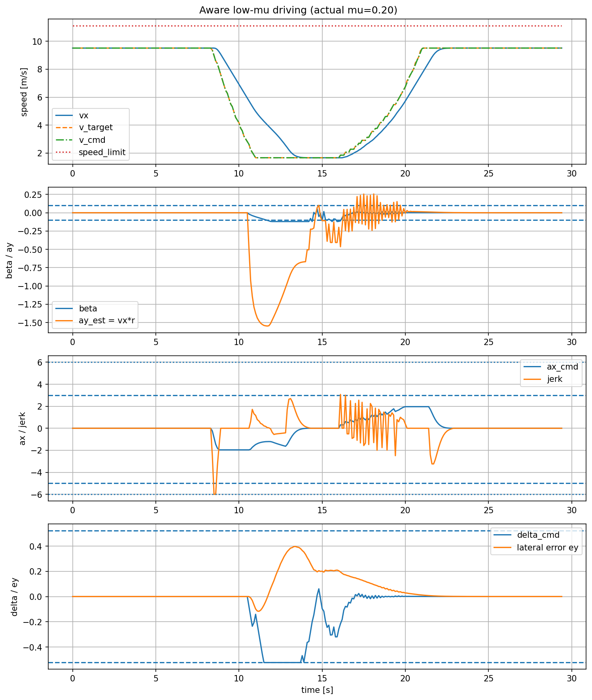
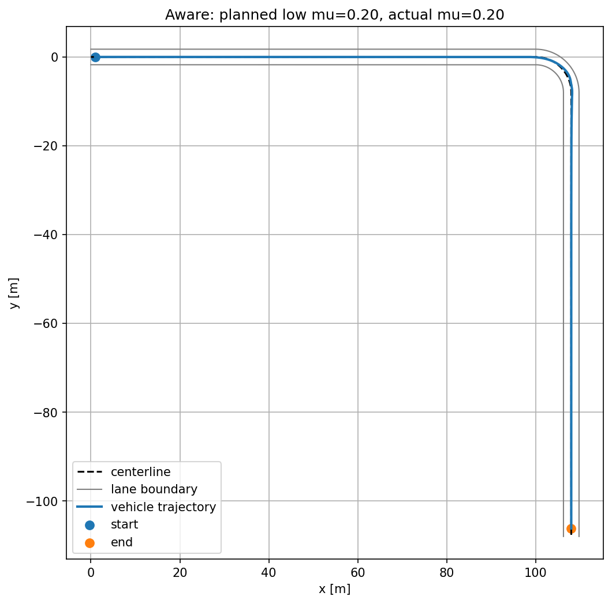
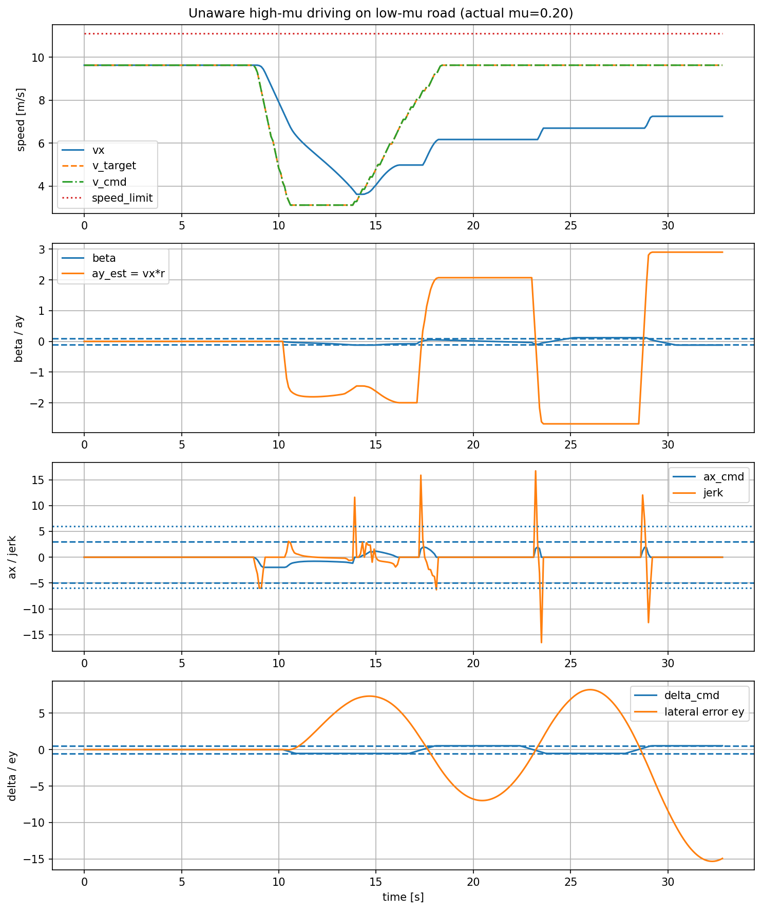
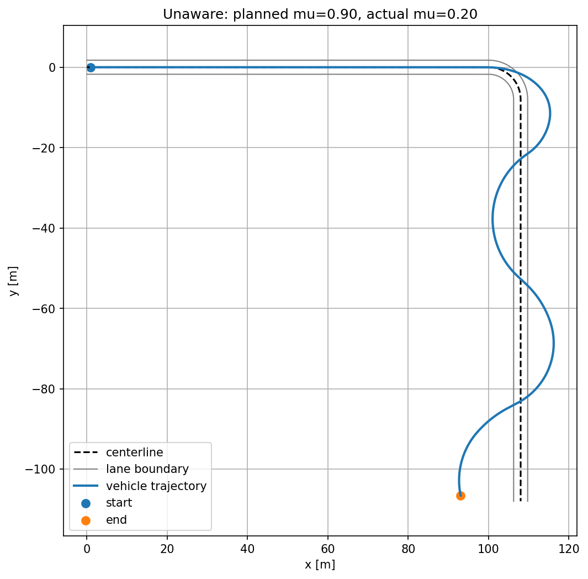

# CAN同化車両モデルを用いた低μ路面右折シナリオ推論

## 1. 目的

本コードでは、CAN実測データで同化・補正した車両運動モデルを用いて、右折シナリオにおける車両挙動を推論する。

特に、以下の2ケースを比較する。

1. **低μ路面を正しく想定して運転した場合**  
   - `planned_mu = 0.20`
   - `actual_mu = 0.20`

2. **高μ路面だと誤認して運転したが、実際は低μ路面だった場合**  
   - `planned_mu = 0.90`
   - `actual_mu = 0.20`

これにより、路面摩擦係数を正しく認識できている場合と、過大評価した場合で、軌道・速度・横滑り・加減速がどのように変化するかを確認する。

---

## 2. 道路設定

今回の道路は、以下のような単純な右折シナリオとして定義する。

```python
road = StraightRightTurnStraightRoad(
    straight1_m=100.0,
    turn_radius_m=8.0,
    straight2_m=100.0,
    lane_width_m=3.5,
    speed_limit_kph=40.0,
    sample_ds=0.5,
)
```

### 道路形状

| 項目 | 値 |
|---|---:|
| 進入直線 | 100 m |
| 右折カーブ | 90度右カーブ |
| カーブ半径 | 8 m |
| 右折後直線 | 100 m |
| 車線幅 | 3.5 m |
| 制限速度 | 40 km/h |

道路中心線は、以下の3区間から構成される。

```text
100m直進
→ 半径8mの右90度カーブ
→ 100m直進
```

車両の横ずれ `ey` は、この道路中心線に対する横方向のずれとして評価する。

---

## 3. 学習済みCAN同化車両モデルの利用

### 3.1 学習済みモデルの読み込み

学習コードで保存したモデルを読み込む。

```python
model = load_model(
    PhysicsInformedVehicleModel,
    priors,
    cfg,
    model_path="out_physics_vehicle/vehicle_model.pt",
    device=device,
)
```

保存ファイル `vehicle_model.pt` には、主に以下が含まれる。

```text
state_dict : 学習済みモデル重み
summary    : 学習時のサマリ情報
```

### 3.2 モデルの役割

このモデルは、単純な bicycle model をベースにしつつ、CAN実測データで観測されたずれを ResidualMLP で補正する。

推論時には、以下の状態を逐次更新する。

```text
state = [x, y, psi, vx, beta, r]
```

| 状態 | 意味 |
|---|---|
| `x` | 絶対座標X位置 |
| `y` | 絶対座標Y位置 |
| `psi` | 車体yaw角 |
| `vx` | 前後速度 |
| `beta` | スリップ角 |
| `r` | ヨーレート |

### 3.3 CAN履歴入力

学習時と同じく、CAN情報は `history_steps=3` の履歴として入力する。

```text
can_hist = [CAN(t-2), CAN(t-1), CAN(t)]
```

各CAN入力は以下の6成分を持つ。

```text
[ax, throttle, rpm, vx, yaw_proxy, yaw_rel]
```

推論時には、主に以下を使う。

| 変数 | 内容 |
|---|---|
| `ax` | 摩擦制限後の実効加速度 |
| `vx` | 現在速度 |
| `yaw_proxy` | 直前のヨーレート |
| `yaw_rel` | yaw信頼フラグ |

`throttle` と `rpm` は今回の軌道推論ではダミー値として扱う。

---

## 4. 摩擦係数の扱い

### 4.1 横方向摩擦

車両モデル内部では、横力に対して摩擦制限が入っている。

```python
fyf = clamp(fyf_lin, -mu * fzf, mu * fzf)
fyr = clamp(fyr_lin, -mu * fzr, mu * fzr)
```

これにより、低μ路面ではタイヤ横力が制限され、旋回性能が低下する。

### 4.2 縦方向摩擦

縦方向については、推論コード側で摩擦円制約を入れる。

```text
ax^2 + ay^2 <= (mu * g)^2
```

ここで、

```text
ay ≈ vx * r
```

と近似する。

制御側が想定する摩擦係数 `control_mu` と、実際の路面摩擦係数 `actual_mu` を分ける。

```text
control_mu : ドライバ／制御器が想定している摩擦係数
actual_mu  : 実際に車両運動に効く摩擦係数
```

これにより、

```text
高μだと思って強くブレーキする
しかし実際は低μなので十分に減速できない
```

という失敗挙動を表現できる。

---

## 5. 操舵設定

操舵は、道路曲率に基づく feed-forward と、中心線からのずれを戻す feedback で決める。

```python
delta_ff = atan(wheelbase * kappa_la)
delta_raw = delta_ff - ky * ey - kpsi * epsi
```

| 項目 | 意味 |
|---|---|
| `delta_ff` | 道路曲率から決まる基本操舵 |
| `ey` | 道路中心線からの横ずれ |
| `epsi` | 道路方向と車体向きのずれ |
| `ky` | 横ずれを戻すゲイン |
| `kpsi` | 向きずれを戻すゲイン |

右折では、通常 `delta_cmd < 0` となる。

### 操舵制約

```python
delta_max = np.deg2rad(30.0)
steer_rate_max = np.deg2rad(45.0)
```

| 制約 | 意味 |
|---|---|
| `delta_max` | 前輪舵角の上限 |
| `steer_rate_max` | 操舵角変化率の上限 |

---

## 6. 速度・加減速設定

### 6.1 目標速度

道路進捗 `s` に応じて、以下のように目標速度を設定する。

```text
進入直線      : v_straight
カーブ手前    : v_straight から v_turn へ減速
カーブ中      : v_turn
カーブ後      : v_turn から v_straight へ加速
```

### 6.2 `v_target` と `v_cmd`

速度には2種類ある。

| 変数 | 意味 |
|---|---|
| `v_target` | 道路位置から決まる理想目標速度 |
| `v_cmd` | 加速度制限を考慮して滑らかに変化させた速度指令 |

`v_target` をそのまま追従すると加減速が波打ちやすいため、実際には `v_cmd` を介して速度を徐々に近づける。

---

## 7. 最適走行の探索

### 7.1 探索対象

最適化では、以下のような運転パラメータを探索する。

```python
PolicyParams(
    v_straight,
    v_turn,
    brake_buffer_m,
    accel_buffer_m,
    lookahead_m,
    ky,
    kpsi,
    kv,
)
```

| パラメータ | 意味 |
|---|---|
| `v_straight` | 直線区間の目標速度 |
| `v_turn` | カーブ中の目標速度 |
| `brake_buffer_m` | カーブ手前何mから減速するか |
| `accel_buffer_m` | カーブ後何mかけて加速するか |
| `lookahead_m` | 操舵時に何m先の道路を見るか |
| `ky` | 横ずれ補正ゲイン |
| `kpsi` | 向きずれ補正ゲイン |
| `kv` | 速度追従ゲイン |

### 7.2 `v_turn` の物理的上限

旋回速度 `v_turn` は、摩擦係数とカーブ半径から概算できる。

```text
v_turn <= sqrt(mu * g * R)
```

ただし、限界ぎりぎりは危険なので、安全率をかける。

```text
v_turn_safe = safety_factor * sqrt(mu * g * R)
```

低μを想定する場合、`v_turn` は低くなる。  
高μを想定する場合、より高い `v_turn` が選ばれやすくなる。

---

## 8. 評価関数

各候補の運転は、以下のスコアで評価する。

```python
score = (
    time_cost
    + goal_penalty_weight * goal_pen
    + lane_violation_weight * lane_pen
    + centerline_error_weight * center_pen
    + beta_violation_weight * beta_pen
    + speed_violation_weight * speed_pen
    + friction_violation_weight * friction_pen
    + jerk_violation_weight * jerk_pen
    + steer_rate_violation_weight * steer_rate_pen
)
```

### 評価項目

| 項目 | 意味 |
|---|---|
| `time_cost` | 走行時間 |
| `goal_pen` | ゴール未到達ペナルティ |
| `lane_pen` | 車線逸脱ペナルティ |
| `center_pen` | 中心線からのずれ |
| `beta_pen` | 横滑り角制約違反 |
| `speed_pen` | 速度制限超過 |
| `friction_pen` | 摩擦円制約違反 |
| `jerk_pen` | jerk制約違反 |
| `steer_rate_pen` | 操舵速度制約違反 |

安全制約違反は、走行時間よりも大きな重みを与え、危険な最短走行が選ばれないようにしている。

---

## 9. 比較ケース

### 9.1 Aware case：低μを正しく認識して運転

```text
planned_mu = 0.20
actual_mu  = 0.20
```

このケースでは、制御側が低μ路面だと分かっているため、十分に減速して右折する。

```python
best_params_aware = optimize_policy(
    assumed_mu=0.20
)
```

実行時も、

```python
run_policy_simulation(
    control_mu=0.20,
    actual_mu=0.20,
)
```

とする。

### 9.2 Unaware case：高μだと誤認して低μ路面を走行

```text
planned_mu = 0.90
actual_mu  = 0.20
```

このケースでは、制御側は高μ路面だと想定しているため、より高い進入速度や強いブレーキを前提にした運転を計画する。

```python
best_params_unaware = optimize_policy(
    assumed_mu=0.90
)
```

しかし実行時には、実際の路面は低μである。

```python
run_policy_simulation(
    control_mu=0.90,
    actual_mu=0.20,
)
```

このため、想定どおりに減速・旋回できず、軌道が外側へ膨らむ。

---

## 10. 結果

### 10.1 低μを正しく認識した場合



低μを正しく認識しているため、車両はカーブ手前で大きく減速し、低速で右折している。  
軌道は道路中心線に対して大きく外れず、車線内を維持している。



このケースでは、カーブ手前で十分に速度を落とすため、低μでも安定して右折できている。

### 10.2 高μだと誤認して低μ路面を走行した場合



高μ路面を想定しているため、速度計画・操舵・加減速が低μ路面に対して攻めすぎている。  
実際には `actual_mu=0.20` であるため、横方向・縦方向の摩擦余力が不足し、横加速度や横ずれが大きくなる。



軌跡を見ると、カーブ中からカーブ後にかけて車両が道路中心線から大きく外れている。  
これは、高μを想定した運転が、実際の低μ路面では成立しないことを示している。

---

## 11. 結果の解釈

今回の比較では、実際の路面は同じ低μである。

```text
actual_mu = 0.20
```

違うのは、制御側がその低μを認識していたかどうかである。

| ケース | 想定μ | 実μ | 結果 |
|---|---:|---:|---|
| Aware | 0.20 | 0.20 | 十分に減速し、安定して右折 |
| Unaware | 0.90 | 0.20 | 減速・旋回が不十分となり、軌道逸脱 |

低μを正しく認識している場合、制御器は早めに減速し、旋回速度を下げるため安定する。  
一方、高μだと誤認すると、速度・ブレーキ・操舵の計画が実路面に対して過大となり、実際には十分な横力・縦力が得られず、車両が外側へ膨らむ。

---

## 12. Alpamayo向け出力

各走行結果について、10Hz相当の egomotion CSV を出力できる。

出力する主な列は以下である。

| 列 | 内容 |
|---|---|
| `t_s` | 時刻 [s] |
| `timestamp_us` | タイムスタンプ [μs] |
| `x_m` | 絶対座標X [m] |
| `y_m` | 絶対座標Y [m] |
| `z_m` | 高さ [m] |
| `yaw_rad` | yaw角 [rad] |
| `qx, qy, qz, qw` | yawから生成したクォータニオン |
| `vx_mps` | 前後速度 |
| `beta_rad` | スリップ角 |
| `yaw_rate_radps` | ヨーレート |

平面運動のため、roll/pitch は 0 とし、yaw のみからクォータニオンを生成する。

```text
qx = 0
qy = 0
qz = sin(yaw / 2)
qw = cos(yaw / 2)
```

これにより、Alpamayo側に対して、位置・姿勢・速度を持つ10Hz時系列として渡すことができる。

---

## 13. まとめ

今回の推論コードでは、CAN同化済みの車両モデルを用いて、道路形状・路面摩擦・安全制約を指定したうえで、右折シナリオの最適走行と失敗走行を比較した。

重要な点は以下である。

```text
1. CAN同化済みモデルにより、bicycle model単体では表現しにくい実車的なずれを補正
2. 横方向摩擦はモデル内部の横力制限で反映
3. 縦方向摩擦は推論コード側の摩擦円制約で反映
4. 低μを正しく認識すると、十分に減速して安定走行
5. 高μと誤認すると、実際の低μ路面では減速・旋回が成立せず軌道逸脱
6. 推論結果はAlpamayo向け10Hz egomotionとして出力可能
```

この構成により、低μ・急カーブなどのロングテール状況で、路面認識の誤りが自動運転モデルの入力軌道にどのような影響を与えるかを評価できる。
